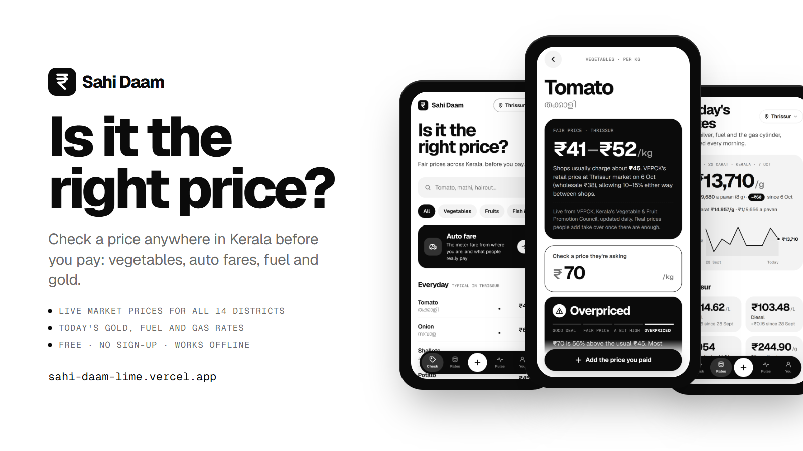

<p align="center"></p>

# Sahi Daam: is it the right price?

**Fair prices across Kerala, before you pay.** Type the price a shop or an auto driver quotes you, and Sahi Daam tells you whether it's a *Good deal*, *Fair price*, *A bit high* or *Overpriced*, and what to offer instead.

**Live:** [sahi-daam-lime.vercel.app](https://sahi-daam-lime.vercel.app) · free · no sign-up · installable and works offline

## What it does

- **Check a price** for 38 everyday items (vegetables, fruit, fish, groceries, tea, meals, a haircut…). Search in English, Malayalam, Hindi or Manglish (*thakkali*, *mathi*).
- **All 14 districts.** Prices are for your district, picked by hand or from your location. Each item shows where it's cheapest this week, and Pulse ranks the districts and has a price table for every district.
- **"You're in Ernakulam right now: vegetables 7% pricier than Thrissur."** If your phone is in another district, the app says so and offers to switch.
- **Today's rates:** 22K and 24K gold per gram and per pavan, silver, and your district's petrol, diesel and LPG cylinder price.
- **Farm prices for growers:** rubber (RSS-4, RSS-5, ISNR-20, latex), pepper, cardamom, nutmeg, mace, clove, coconut, copra, arecanut, coffee, cocoa, cashew, paddy and tapioca.
- **Auto fare:** start from where you are, search any place in Kerala, and see the meter fare on the real road distance, with a big "Show the driver" screen in English and Malayalam.
- **Add what you paid.** It's anonymous and takes five seconds. Real reports take over from market prices once there are enough.

## Where the prices come from

| Source | What | Used for |
|---|---|---|
| [VFPCK](https://www.vfpck.org/) (Kerala's Vegetable & Fruit Promotion Council) | Daily retail and wholesale prices at 7 district markets | Vegetable shop prices. The main source. |
| [Agmarknet](https://agmarknet.gov.in/) (Govt. of India) | Daily mandi (wholesale) prices per district | Items and districts VFPCK doesn't cover, labelled as estimates |
| [Goodreturns](https://www.goodreturns.in/) | Fuel and LPG per district, gold and silver for Kerala | Today's rates |
| [Rubber Board](https://rubberboard.gov.in/) | Daily RSS-4, RSS-5, ISNR-20 and latex prices, Kottayam | Farm prices |
| [Spices Board](https://www.indianspices.com/) | Daily Kochi prices for pepper, nutmeg, mace and clove, and the small-cardamom e-auctions | Farm prices |
| People using the app | What they actually paid | Takes over once an item has enough recent reports |

**Every price shown is real.** Items with no public source (fish, meat, eggs, milk, services) show "–" until people report what they paid.

**How fresh:** the server checks gold and silver every 15 minutes and everything else every hour. The app checks every minute while it's open, reading one tiny row, and downloads prices only when something changed. Each price shows its own date, and the Rates tab shows when the server last checked. The sources themselves publish about once a day (fuel at 6 am, markets in the afternoon, LPG monthly), so polling them every minute wouldn't make anything more accurate.

**An honest limitation:** only VFPCK publishes shop prices, for 7 districts. The other districts show their mandi price as plain text and aren't ranked. Mandi levels differ for reasons that have nothing to do with shops (Wayanad's mandis ran at about half the Kerala middle on every vegetable), so comparing them with shop prices would mislead.

## How "fair" is worked out

1. **Pool:** reports for the item from the last 7 days in your district, widening to all of Kerala and then to 30 days when there are too few.
2. **Clean:** drop outliers with the modified z-score, `|0.6745 · (x − median) / MAD| > 3.5`, so one tourist price or typo can't move the range.
3. **Range:** fair is the middle half (P25–P75) and typical is the median. Above P75 × 1.15 is *overpriced*.
4. **Live prices:** a VFPCK shop price gives a band from 10% below to 15% above it. An Agmarknet mandi price adds a typical 10–45% shop margin and is shown as an estimate.

The same maths runs in the browser (offline) and in Postgres (`fair_range()`), and a script checks the two agree on 579 test pools.

## Under the hood

```
 Phone (React 19 PWA, IndexedDB cache)  ──reads──▶  Supabase Postgres  ◀──writes── Edge Function (pg_cron, every 15 min / hourly)
   │  anonymous sign-in, offline send queue          RLS · rate limits                 ├─ VFPCK, 7 markets
   └─ Photon + OSRM (OpenStreetMap) for places       security-definer reads            ├─ Agmarknet, 14 districts
      and road distance; location never leaves       (no user ids)                     └─ Goodreturns fuel, LPG, gold
      the phone otherwise
```

- **No accounts, still abuse-resistant:** anonymous Supabase sign-in, row-level security (you can only see and delete your own rows), 30 prices a day per account, a 10-minute delay before a new account's prices count, and server-set timestamps. Everyone's prices are read through functions that never return who reported what.
- **Built to survive a launch spike:** incremental sync (a return visit downloads only what's new), keyset pagination, and an IndexedDB cache. In a load test with 60,000 reports, return visits took about 25 ms at p95 with 1,000 users in 20 s, with no errors, and the production build stays smooth on a 4× throttled phone CPU.
- **Findable on search engines:** after `vite build`, `scripts/seo.mjs` writes a static page for every route (home, rates, pulse, auto and each of the 38 items) with its own title, description, canonical URL and readable text, plus `sitemap.xml`, `robots.txt` and schema.org data. The app takes over when it loads.
- **Tests:** 57 unit tests (price engine, live-data parsers, district logic), 23 pgTAP database tests, a SQL-vs-JS parity check, and 31 end-to-end security checks run against the real API with throwaway accounts.

## Run it locally

```bash
npm install
npm run dev          # http://localhost:3100 (demo data, nothing leaves your machine)
npm test
npm run build
```

To share prices, copy `.env.example` to `.env.local` and point it at a Supabase project. For a local backend (needs Docker):

```bash
npx supabase start            # local Postgres + Auth + API, applies supabase/migrations
npx supabase status -o env    # API_URL and PUBLISHABLE_KEY go in .env.local
npm run db:test               # pgTAP tests
npm run check:sql             # SQL fair_range() vs the JS engine
npm run check:backend         # security rules, with two throwaway anonymous accounts
```

Deploy with `npm run deploy`. For database changes, add a migration, then run `npx supabase db push`.

## Where things are

```
src/lib/stats.js      fair-price engine: quantiles, MAD outlier filter, verdicts, trends
src/lib/market.js     live prices per district → fair ranges, trends, district comparisons
src/lib/fare.js       Kerala auto meter fare and "what people pay" ratios
src/lib/geo.js        GPS → district, place search (Photon), road distance (OSRM)
src/lib/store.js      app state, offline send queue, incremental sync
src/lib/remote.js     every Supabase call
src/lib/catalog.js    items (Malayalam/Hindi names), the 14 districts, Kochi landmarks
src/lib/farm.js       the farm prices shown on the Rates tab
src/screens/          Check, Item, Auto, Rates, Pulse, You
supabase/migrations/  tables, row-level security, limits, fair_price() in SQL
supabase/functions/   refresh-prices: the data job (gold every 15 min, the rest hourly)
supabase/tests/       pgTAP tests
marketing/            logo, post images, screenshots, launch posts
```

The roadmap, including the plan for the rest of India, is in [PLAN.md](PLAN.md).

---

Prices are a guide, not an official rate. Gold and silver are board rates before making charges and GST. The auto fare uses Kerala's meter rate: ₹30 for the first 1.5 km, then ₹1.50 for every 100 m, and 50% extra from 10 pm to 5 am.
